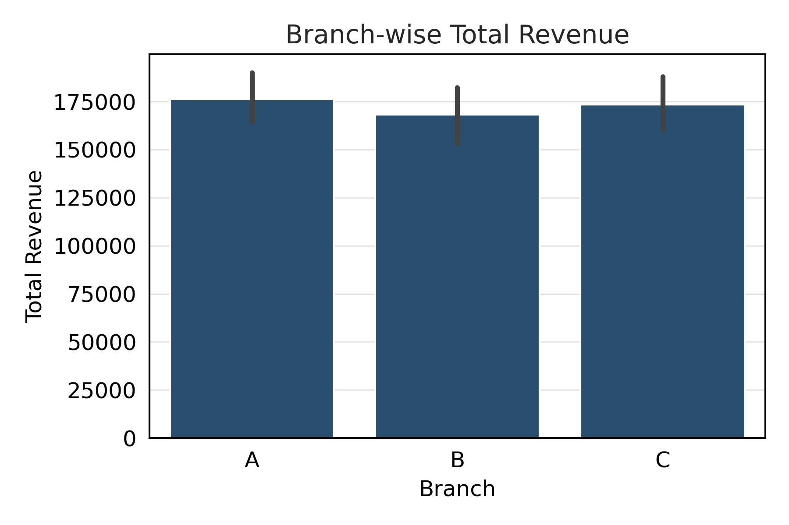
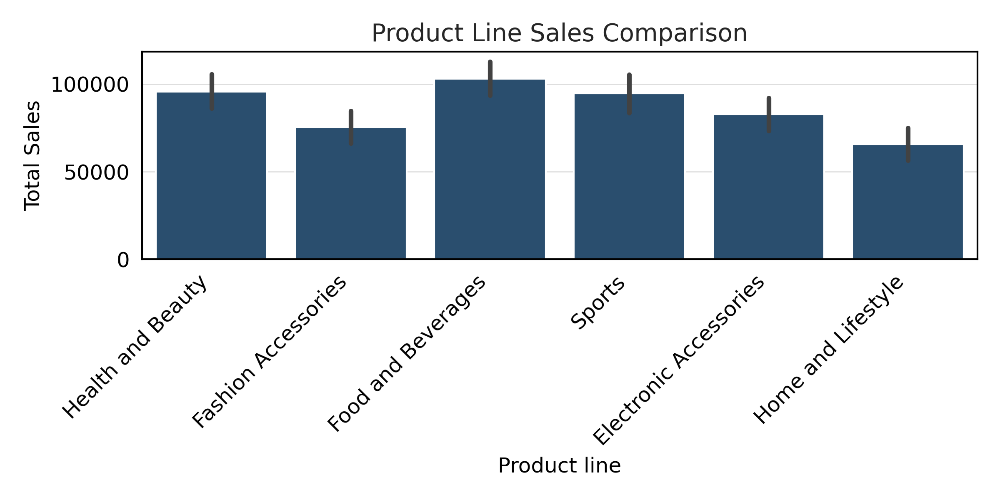
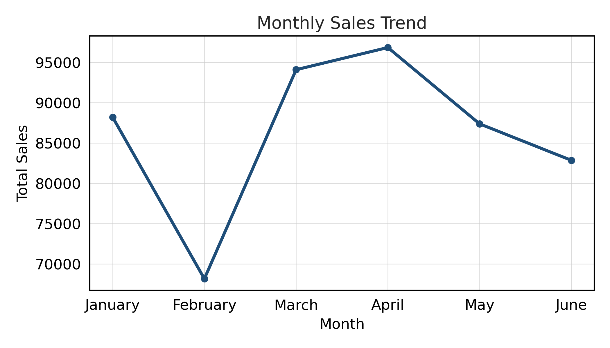
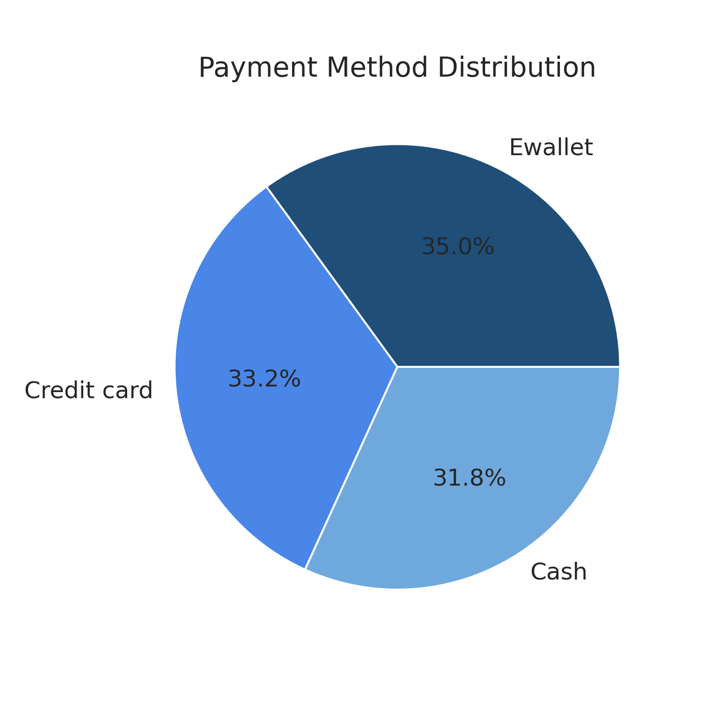
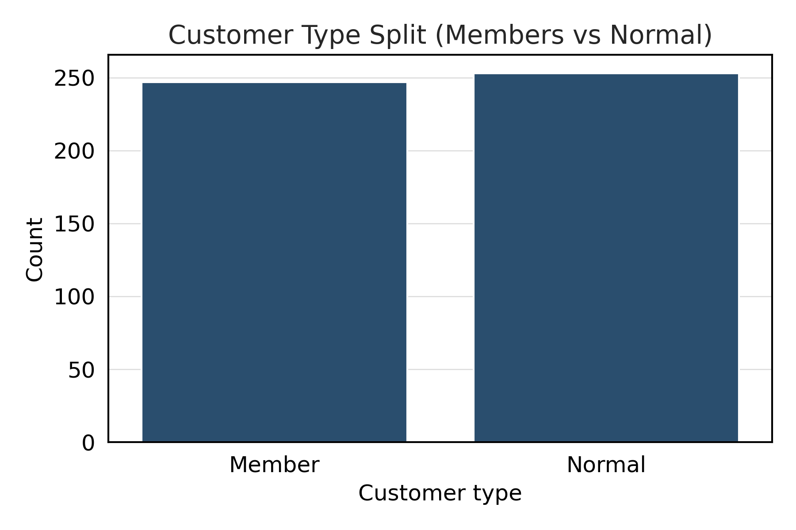
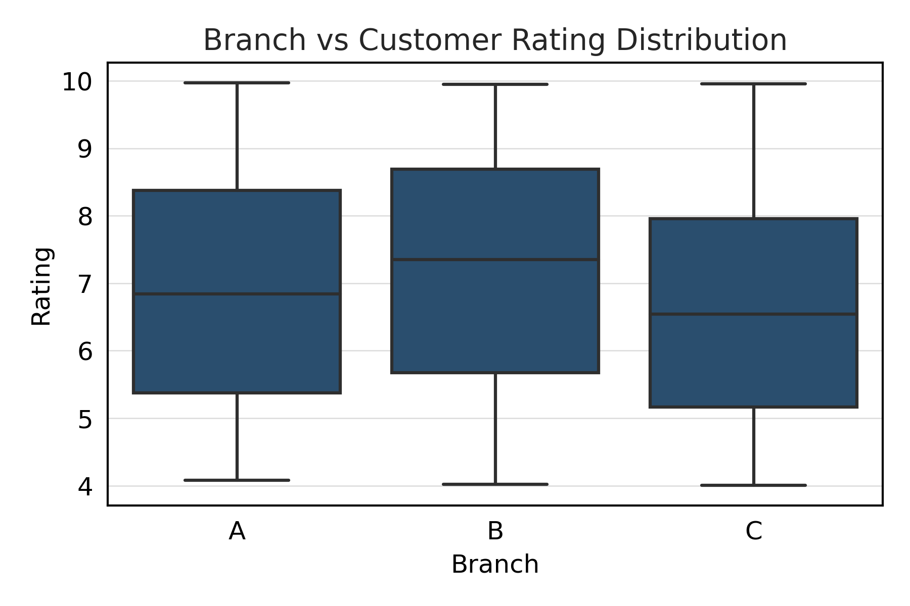
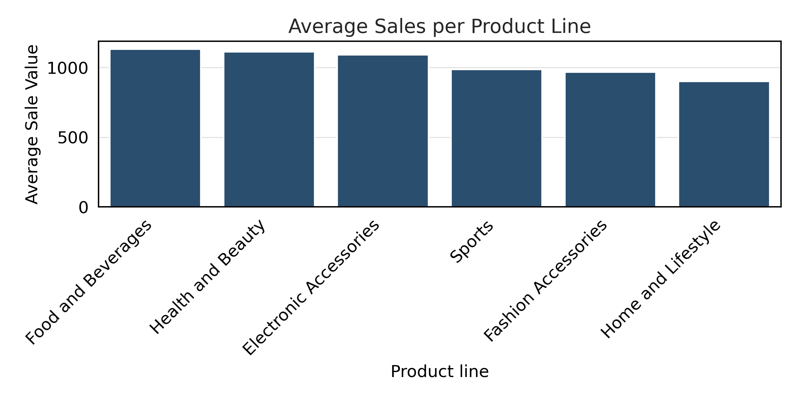

> A Data Analytics Project to uncover sales trends, customer behavior, and business insights from supermarket transaction data.  
> Built using Python, Pandas, and Seaborn — following the CRISP-DM data science methodology.

---

## 📚 Table of Contents
- [Project Overview](#project-overview)
- [Objectives](#objectives)
- [Dataset Description](#dataset-description)
- [Tech Stack](#tech-stack)
- [Methodology](#methodology)
- [Visual Highlights](#visual-highlights)
- [Key Insights](#key-insights)
- [Conclusion](#conclusion)
- [How to Run](#how-to-run)
- [Author](#author)

---

## 🧾 Project Overview
This project provides an end-to-end **exploratory data analysis (EDA)** of supermarket sales data to identify:
- Best-performing branches and products  
- Monthly sales patterns and customer ratings  
- Preferred payment modes and customer segments  

The goal is to empower data-driven decisions for **marketing**, **inventory management**, and **branch performance optimization**.

---

## 🎯 Objectives
- 🏬 Compare **branch-wise revenue** and identify top performers  
- 💳 Understand **customer payment preferences**  
- 📆 Detect **seasonal sales trends**  
- 👥 Analyze **customer types and satisfaction**  
- 💹 Recommend **actionable business improvements**

---

## 🧩 Dataset Description
**File:** `super_market_data.csv`  
**Records:** ~1,000 transactions  
**Features:**

| Column | Description |
|---------|-------------|
| Branch | Store branch (A, B, or C) |
| City | Branch location |
| Customer type | Member or Normal |
| Gender | Customer gender |
| Product line | Product category |
| Unit price | Price per item |
| Quantity | Items purchased |
| Tax 5% | Tax on total sale |
| Total | Final bill amount |
| Date, Time | Transaction timestamp |
| Payment | Payment method |
| Rating | Customer satisfaction (1–10) |

---

## 🧰 Tech Stack
| Purpose | Tools |
|----------|-------|
| Programming | Python 3.x |
| Data Analysis | Pandas, NumPy |
| Visualization | Matplotlib, Seaborn |
| Notebook | Jupyter Notebook |
| Version Control | Git & GitHub |

---

## 🧠 Methodology (CRISP-DM Framework)
1. **Business Understanding** – Define supermarket KPIs and sales goals.  
2. **Data Understanding** – Explore dataset structure, variables, and relationships.  
3. **Data Preparation** – Clean, transform, and feature-engineer the data.  
4. **Modeling / Visualization** – Use descriptive analysis and charts to uncover insights.  
5. **Evaluation** – Validate findings and summarize metrics.  
6. **Deployment** – Publish results in this GitHub repository.

---

## 📈 Visual Highlights

### 🏬 Branch-wise Total Revenue 


### 🛍️ Product Line Sales Comparison


### 📆 Monthly Sales Trend


### 💳 Payment Method Distribution


### 👥 Customer Type Split


### 🔥 Correlation Heatmap


### ⭐ Branch vs Customer Rating 


### 💹 Average Sales per Product Line


---
---

## 💡 Key Insights
📊 **Branch C** achieved the **highest total revenue**, followed by Branch B.  
💳 **E-wallet** payments dominated, showing strong digital adoption.  
📆 **Sales peaked in March**, likely due to seasonal promotions.  
👩‍🦱 **Member customers** generated more total revenue than normal shoppers.  
📦 **Food & Beverages** and **Health & Beauty** were the top-selling product lines.  
⭐ **Average customer rating ≈ 7.1**, indicating room for service improvement.

---

## 🏁 Conclusion
This analysis highlights how **data visualization and pattern discovery** can transform raw supermarket data into meaningful business insights.

By leveraging Python and visual analytics, businesses can:
- Identify high-performing products and branches  
- Optimize stock and marketing strategies  
- Improve customer engagement and loyalty programs  

---

## ⚙️ How to Run
```bash
# Clone the repository
git clone https://github.com/Shrishma18/SuperMarket-Sales-Analysis.git

# Navigate to project folder
cd SuperMarket-Sales-Analysis

# Install dependencies
pip install -r requirements.txt

# Launch Jupyter Notebook
jupyter notebook Super_Market_Analysis.ipynb
